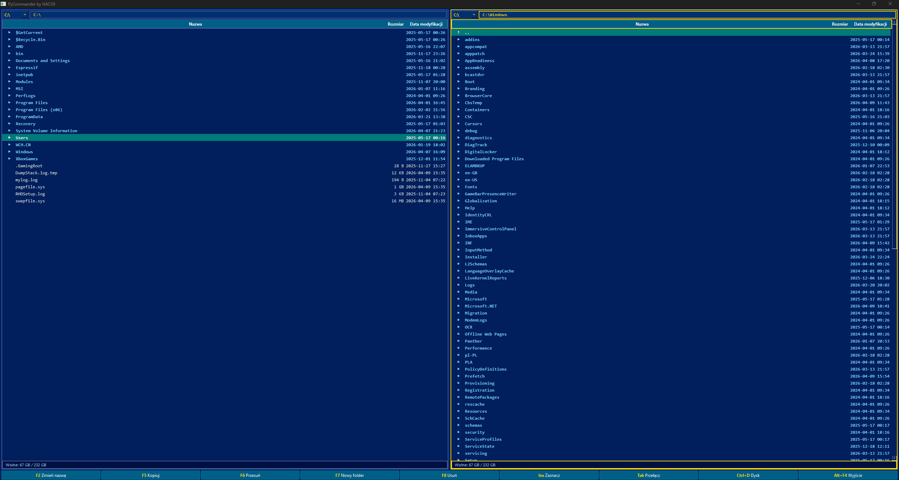
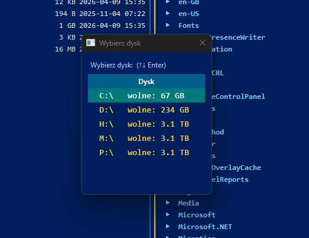
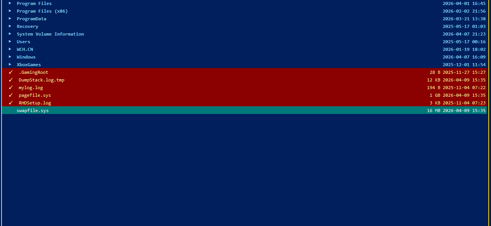

# PyCommander by HACS9

> A keyboard-driven two-panel file manager for Windows 11, inspired by the classic Norton Commander.



---

## Why PyCommander?

If you grew up with Norton Commander or Total Commander, you know the feeling — two panels, keyboard shortcuts, and everything just *works*. PyCommander brings that experience to Windows 11 with a clean modern look, without sacrificing the classic workflow.

---

## Features

- **Two-panel layout** — navigate two locations side by side
- **Keyboard-first** — F2, F5, F6, F7, F8 and more, just like the original
- **Open files** — press Enter on any file to open it with its default Windows application
- **Multi-select** — mark multiple files with Insert or Space, then copy/move/delete them all at once
- **Drive switcher** — change drive per panel via dropdown or Ctrl+D shortcut
- **Search** — filter files in the active panel instantly with `/`
- **Rename** — F2 inline rename with the current name pre-filled
- **Windows Shell API** — copy and move operations use the native Windows Shell, so UAC elevation works automatically when needed (e.g. writing to C:\\)
- **Safe delete** — always asks for confirmation, no accidental deletions
- **Smart panel recovery** — if you delete a folder that the other panel is open in, it automatically navigates up to the nearest existing parent

---

## Keyboard Shortcuts

| Key | Action |
|-----|--------|
| `↑ ↓` | Navigate files |
| `Enter` | Open file / enter folder |
| `Backspace` | Go up one level |
| `Tab` | Switch active panel |
| `F2` | Rename |
| `F5` | Copy to other panel |
| `F6` | Move to other panel |
| `F7` | New folder |
| `F8` / `Delete` | Delete |
| `Insert` / `Space` | Mark/unmark file (multi-select) |
| `Ctrl+D` | Change drive (active panel) |
| `/` | Search in active panel |
| `Esc` | Clear search |
| `Ctrl+R` | Refresh both panels |
| `Alt+F4` | Exit |

---

## Screenshots

| Main view | Drive selector | Multi-select |
|-----------|---------------|--------------|
|  |  |  |

---

## Installation & Running from Source

**Requirements:**
- Python 3.10 or newer
- Windows 10 / 11

**Install dependencies:**
```bash
pip install PyQt6 pywin32
```

**Run:**
```bash
python main.py
```

---

## Download (Windows .exe)

No Python required — just download and run.

👉 **[Download latest release](../../releases/latest)**

The `.exe` is a single self-contained file built with PyInstaller.

---

## Building the .exe yourself

```bash
pip install pyinstaller pywin32
pyinstaller --onefile --windowed --hidden-import win32com.shell --name PyCommander main.py
```

Output will be in the `dist\` folder.

---

## Project Structure

```
PyCommander/
├── main.py          # entire application — single file
├── README.md
├── .gitignore
└── screenshots/     
    ├── main.png
    ├── drive.png
    └── multi.png
```

---

## .gitignore

```
build/
dist/
*.spec
__pycache__/
*.pyc
```

---

## Tech Stack

| | |
|---|---|
| Language | Python 3.12 |
| UI Framework | PyQt6 |
| File operations | Windows Shell API (pywin32) + shutil |
| Packaging | PyInstaller |

---

## Roadmap

Ideas for future versions:

- [ ] File preview (text, images)
- [ ] ZIP/archive support
- [ ] Bookmarks / favourite folders
- [ ] Progress bar for large file operations
- [ ] Configurable color themes

---

## License

MIT — do whatever you want with it.

---

*Built with Python and PyQt6. Inspired by Norton Commander (Peter Norton, 1986).*
